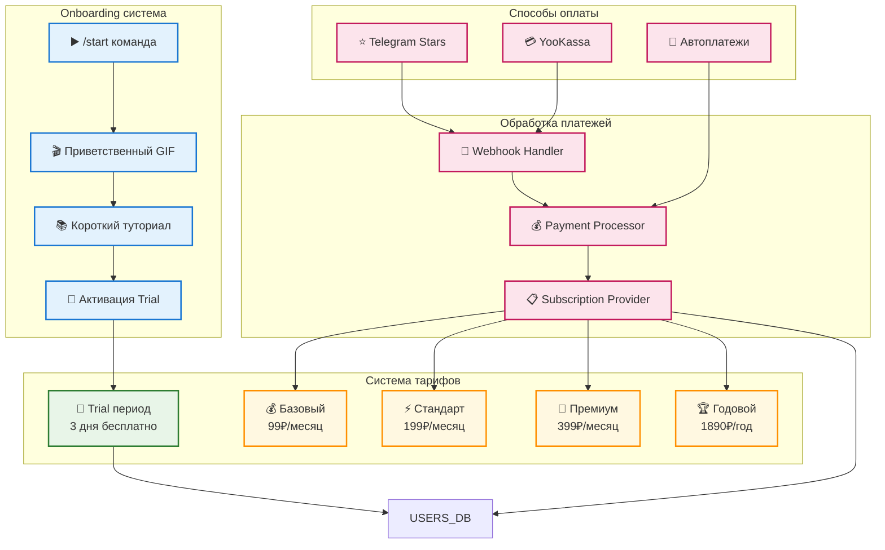
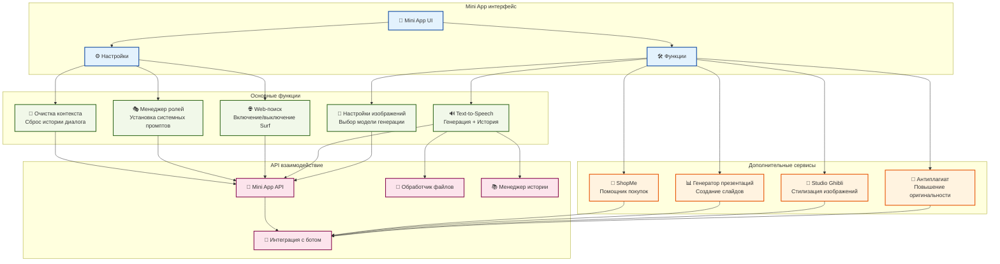

# Высокоуровневая схема архитектуры GptBot_v2

## Основная архитектура системы

```mermaid
graph TB
    %% Пользователи и внешние интерфейсы
    subgraph "Пользователи"
        U1[👤 Telegram Пользователи]
        U2[👨‍💼 Администраторы]
    end

    %% Входные точки
    subgraph "Входные точки"
        TG[📱 Telegram Bot API<br/>Основной чат с ИИ]
        MINIAPP[📲 Mini App<br/>Настройки и функции]
    end

    %% Основное приложение
    subgraph "Основное приложение"
        MAIN[🤖 bot/main.py<br/>Главный обработчик]
        HANDLERS[📋 handlers/<br/>Обработчики команд]
        RUN[▶️ run.py<br/>Точка входа]
    end

    %% Mini App функции
    subgraph "Mini App функции"
        MINIAPP_SETTINGS[⚙️ Настройки]
        MINIAPP_CONTEXT[🧹 Очистка контекста]
        MINIAPP_ROLES[🎭 Управление ролями]
        MINIAPP_SURF[🌐 Web-поиск Surf]
        MINIAPP_TTS[🔊 Text-to-Speech]
        MINIAPP_IMAGE[🎨 Генерация изображений]
        MINIAPP_SERVICES[🛠️ Доп. сервисы]
    end

    %% Дополнительные сервисы Mini App
    subgraph "Дополнительные сервисы"
        SHOPME[🛒 ShopMe]
        PRESENTATIONS[📊 Генерация презентаций]
        GHIBLI[🎌 Studio Ghibli стиль]
        ANTIPLAGIAT[📝 Антиплагиат]
    end

    %% Система обработки сообщений
    subgraph "Обработка сообщений"
        CONTENT[📝 Content Handlers<br/>text, photo, voice, etc.]
        COMMANDS[⚡ Command Handlers<br/>/image, /surf, /talk, /role]
        CALLBACKS[🔘 Callback Handlers<br/>Inline кнопки]
        ONBOARDING[🎯 Onboarding System<br/>GIF + Tutorial]
    end

    %% ИИ и внешние сервисы
    subgraph "ИИ сервисы"
        OPENAI[🧠 OpenAI GPT-4]
        CLAUDE[🧠 Claude 3.5]
        DEEPSEEK[🧠 DeepSeek-R1]
        GROK[🧠 Grok-3]
        STABILITY[🎨 Stable Diffusion]
        DALLE[🎨 DALL-E]
    end

    %% Система управления контекстом
    subgraph "Управление контекстом"
        REDIS[📦 Redis<br/>Контекст диалогов]
        GLOBAL[🌐 Global.py<br/>Глобальное состояние]
    end

    %% Система оплаты
    subgraph "Система оплаты"
        YOOKASSA[💳 YooKassa API]
        TGSTARS[⭐ Telegram Stars]
        AUTOPAY[🔄 Автоплатежи]
        WEBHOOKS[🔗 Webhooks]
    end

    %% Базы данных
    subgraph "Базы данных"
        USERS_DB[(👥 Users.db<br/>Пользователи)]
        DATA_DB[(📊 Data.db<br/>Аналитика)]
        KEYS_DB[(🔑 Keys.db<br/>Ключи и подарки)]
    end

    %% Система задач
    subgraph "Система задач"
        TASK_PROCESSOR[⚙️ Task Processor<br/>Обработчик задач]
        REDIS_QUEUE[📋 Redis Queue<br/>Очередь задач]
        FIFO[📄 FIFO Fallback<br/>Резервная очередь]
    end

    %% Аналитика и мониторинг
    subgraph "Аналитика"
        ANALYTICS[📈 Анализ данных<br/>analisys/]
        LOGS[📝 Логирование<br/>security.log]
        MONITORING[👀 Мониторинг<br/>bureau/]
    end

    %% Система генерации документов
    subgraph "Генерация документов"
        DOC_PROCESSOR[📄 Document Processor<br/>Умная генерация]
        EXCEL_GEN[📊 Excel Generator]
        PDF_GEN[📄 PDF Generator]
        DOCX_GEN[📝 DOCX Generator]
        TABLE_PARSER[📋 Table Parser<br/>Legacy | символы]
    end

    %% Система тарифов и онбординга
    subgraph "Тарифы и подписки"
        TRIAL[🎁 Trial 3 дня<br/>Бесплатный период]
        TARIFF_99[💰 Classic 99₽]
        TARIFF_199[⚡ Premium 199₽]
        TARIFF_399[👑 Ultima 399₽]
        TARIFF_1890[🏆 Ultima-12 1890₽]
    end

    %% Дополнительные сервисы
    subgraph "Внешние сервисы"
        INVOICE[🧾 Чеки ОФД<br/>invoice_mh/]
        YOUTUBE[📺 YouTube QA]
    end

    %% Связи
    U1 --> TG
    U1 --> MINIAPP
    U2 --> TG

    TG --> MAIN
    MINIAPP --> MAIN

    MAIN --> RUN
    MAIN --> HANDLERS
    MAIN --> ONBOARDING
    HANDLERS --> CONTENT
    HANDLERS --> COMMANDS
    HANDLERS --> CALLBACKS

    %% Mini App связи
    MINIAPP --> MINIAPP_SETTINGS
    MINIAPP --> MINIAPP_CONTEXT
    MINIAPP --> MINIAPP_ROLES
    MINIAPP --> MINIAPP_SURF
    MINIAPP --> MINIAPP_TTS
    MINIAPP --> MINIAPP_IMAGE
    MINIAPP --> MINIAPP_SERVICES

    MINIAPP_SERVICES --> SHOPME
    MINIAPP_SERVICES --> PRESENTATIONS
    MINIAPP_SERVICES --> GHIBLI
    MINIAPP_SERVICES --> ANTIPLAGIAT

    CONTENT --> OPENAI
    CONTENT --> CLAUDE
    CONTENT --> DEEPSEEK
    CONTENT --> GROK
    COMMANDS --> STABILITY
    COMMANDS --> DALLE

    MAIN --> REDIS
    HANDLERS --> GLOBAL
    GLOBAL --> REDIS

    %% Связи с системой оплаты
    CALLBACKS --> YOOKASSA
    CALLBACKS --> TGSTARS
    YOOKASSA --> WEBHOOKS
    AUTOPAY --> YOOKASSA
    
    %% Связи с тарифами
    ONBOARDING --> TRIAL
    CALLBACKS --> TARIFF_99
    CALLBACKS --> TARIFF_199
    CALLBACKS --> TARIFF_399
    CALLBACKS --> TARIFF_1890

    MAIN --> USERS_DB
    HANDLERS --> DATA_DB
    MAIN --> KEYS_DB

    TASK_PROCESSOR --> REDIS_QUEUE
    REDIS_QUEUE --> FIFO

    HANDLERS --> ANALYTICS
    MAIN --> LOGS
    MONITORING --> USERS_DB

    %% Связи с генерацией документов
    HANDLERS --> DOC_PROCESSOR
    DOC_PROCESSOR --> EXCEL_GEN
    DOC_PROCESSOR --> PDF_GEN
    DOC_PROCESSOR --> DOCX_GEN
    HANDLERS --> TABLE_PARSER

    HANDLERS --> INVOICE
    HANDLERS --> YOUTUBE

    %% Стили
    classDef userClass fill:#e1f5fe,stroke:#01579b,stroke-width:2px
    classDef botClass fill:#f3e5f5,stroke:#4a148c,stroke-width:2px
    classDef aiClass fill:#e8f5e8,stroke:#1b5e20,stroke-width:2px
    classDef dbClass fill:#fff3e0,stroke:#e65100,stroke-width:2px
    classDef payClass fill:#fce4ec,stroke:#880e4f,stroke-width:2px
    classDef miniappClass fill:#e3f2fd,stroke:#0d47a1,stroke-width:2px
    classDef serviceClass fill:#f1f8e9,stroke:#33691e,stroke-width:2px
    classDef tariffClass fill:#fff8e1,stroke:#ff8f00,stroke-width:2px
    classDef docClass fill:#fafafa,stroke:#424242,stroke-width:2px
    
    class U1,U2 userClass
    class MAIN,HANDLERS,RUN,ONBOARDING botClass
    class OPENAI,CLAUDE,DEEPSEEK,GROK,STABILITY,DALLE aiClass
    class USERS_DB,DATA_DB,KEYS_DB dbClass
    class YOOKASSA,TGSTARS,AUTOPAY,WEBHOOKS payClass
    class MINIAPP,MINIAPP_SETTINGS,MINIAPP_CONTEXT,MINIAPP_ROLES,MINIAPP_SURF,MINIAPP_TTS,MINIAPP_IMAGE,MINIAPP_SERVICES miniappClass
    class SHOPME,PRESENTATIONS,GHIBLI,ANTIPLAGIAT serviceClass
    class TRIAL,TARIFF_99,TARIFF_199,TARIFF_399,TARIFF_1890 tariffClass
    class DOC_PROCESSOR,EXCEL_GEN,PDF_GEN,DOCX_GEN,TABLE_PARSER docClass
```

## Детализация системы обработки сообщений


## Схема системы оплаты и тарифов



## Архитектура Mini App



## Схема генерации документов

```mermaid
graph TB
    subgraph "Входные данные"
        AI_RESPONSE[🧠 Ответ ИИ]
        USER_REQUEST[👤 Запрос пользователя]
        LEGACY_PARSER[📋 Legacy парсер<br/>Символы | в тексте]
    end

    subgraph "Система обработки"
        CONTENT_ANALYZER[🔍 Анализатор контента<br/>Определение типа документа]
        FUNCTION_ROUTER[🔀 Маршрутизатор функций<br/>Выбор генератора]
        SMART_PROCESSOR[🧠 Умный процессор<br/>ИИ-анализ структуры]
    end

    subgraph "Генераторы документов"
        EXCEL_GENERATOR[📊 Excel Generator<br/>Таблицы и графики]
        PDF_GENERATOR[📄 PDF Generator<br/>Отчёты и документы]
        DOCX_GENERATOR[📝 DOCX Generator<br/>Текстовые документы]
        POWERPOINT_GEN[📊 PowerPoint Generator<br/>Презентации]
    end

    subgraph "Выходные данные"
        DOCUMENT_FILE[📁 Готовый документ]
        DOWNLOAD_LINK[🔗 Ссылка на скачивание]
        TELEGRAM_FILE[📤 Отправка в Telegram]
    end

    %% Current flow (legacy)
    AI_RESPONSE --> LEGACY_PARSER
    LEGACY_PARSER --> DOCX_GENERATOR
    
    %% Future flow (smart)
    USER_REQUEST --> CONTENT_ANALYZER
    AI_RESPONSE --> CONTENT_ANALYZER
    CONTENT_ANALYZER --> SMART_PROCESSOR
    SMART_PROCESSOR --> FUNCTION_ROUTER
    
    FUNCTION_ROUTER --> EXCEL_GENERATOR
    FUNCTION_ROUTER --> PDF_GENERATOR
    FUNCTION_ROUTER --> DOCX_GENERATOR
    FUNCTION_ROUTER --> POWERPOINT_GEN
    
    %% Output handling
    EXCEL_GENERATOR --> DOCUMENT_FILE
    PDF_GENERATOR --> DOCUMENT_FILE
    DOCX_GENERATOR --> DOCUMENT_FILE
    POWERPOINT_GEN --> DOCUMENT_FILE
    
    DOCUMENT_FILE --> DOWNLOAD_LINK
    DOCUMENT_FILE --> TELEGRAM_FILE

    %% Styling
    classDef inputClass fill:#e8f5e8,stroke:#2e7d32,stroke-width:2px
    classDef processClass fill:#e3f2fd,stroke:#1976d2,stroke-width:2px
    classDef generatorClass fill:#fff3e0,stroke:#f57c00,stroke-width:2px
    classDef outputClass fill:#f3e5f5,stroke:#7b1fa2,stroke-width:2px
    classDef legacyClass fill:#ffebee,stroke:#d32f2f,stroke-width:2px,stroke-dasharray: 5 5
    
    class AI_RESPONSE,USER_REQUEST inputClass
    class CONTENT_ANALYZER,FUNCTION_ROUTER,SMART_PROCESSOR processClass
    class EXCEL_GENERATOR,PDF_GENERATOR,DOCX_GENERATOR,POWERPOINT_GEN generatorClass
    class DOCUMENT_FILE,DOWNLOAD_LINK,TELEGRAM_FILE outputClass
    class LEGACY_PARSER legacyClass
```
