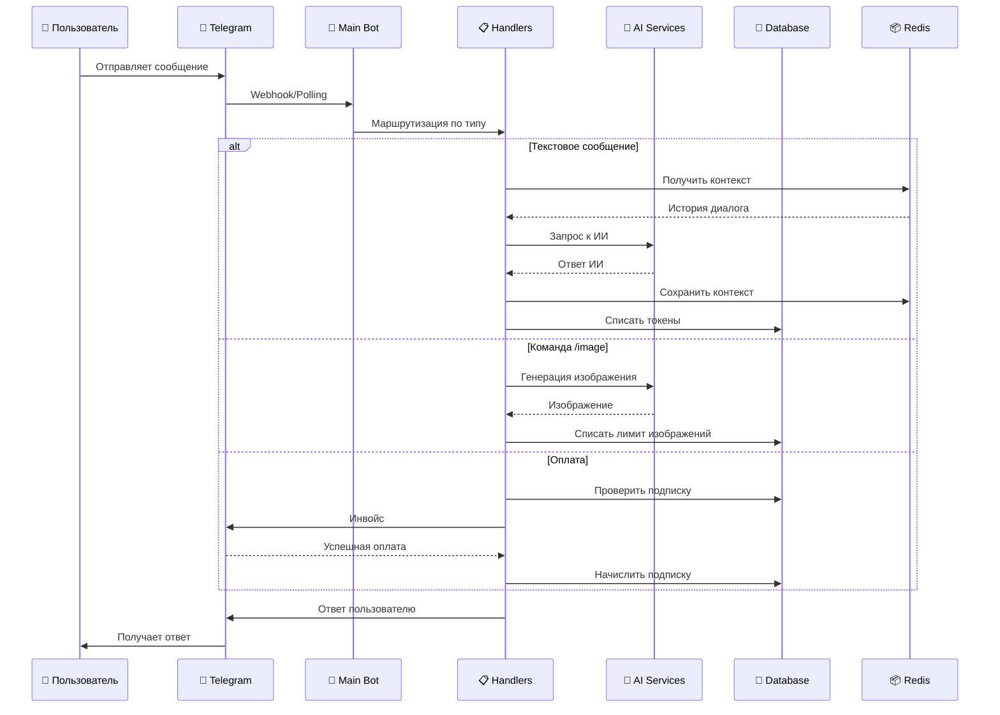
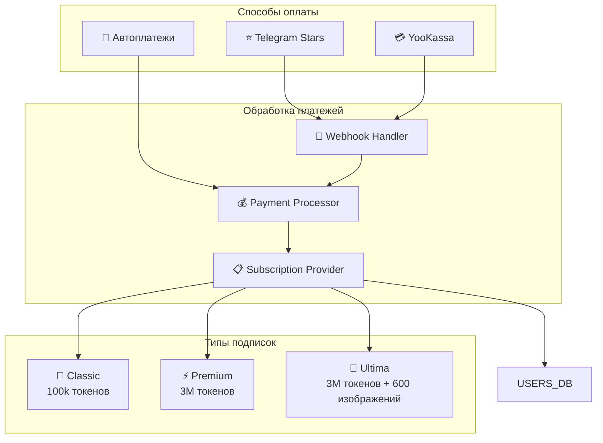

# Высокоуровневая схема архитектуры GptBot_v2

## Основная архитектура системы

```mermaid
graph TB
    %% Пользователи и внешние интерфейсы
    subgraph "Пользователи"
        U1[👤 Telegram Пользователи]
        U2[🌐 Web Пользователи]
        U3[👨‍💼 Администраторы]
    end

    %% Входные точки
    subgraph "Входные точки"
        TG[📱 Telegram Bot API]
        WEB1[🌐 menu.chatbotiq.ru]
        WEB2[🌐 menu2.chatbotiq.ru]
        WEB3[🌐 presentations.chatbotiq.ru]
    end

    %% Основное приложение
    subgraph "Основное приложение"
        MAIN[🤖 bot/main.py<br/>Главный обработчик]
        HANDLERS[📋 handlers/<br/>Обработчики команд]
        RUN[▶️ run.py<br/>Точка входа]
    end

    %% Дублированная система
    subgraph "Дублированная система"
        BOT2[🤖 bot_2/<br/>Резервный бот]
    end

    %% Система обработки сообщений
    subgraph "Обработка сообщений"
        CONTENT[📝 Content Handlers<br/>text, photo, voice, etc.]
        COMMANDS[⚡ Command Handlers<br/>/image, /surf, /talk, /role]
        CALLBACKS[🔘 Callback Handlers<br/>Inline кнопки]
    end

    %% ИИ и внешние сервисы
    subgraph "ИИ сервисы"
        OPENAI[🧠 OpenAI GPT-4]
        CLAUDE[🧠 Claude 3.5]
        DEEPSEEK[🧠 DeepSeek-R1]
        GROK[🧠 Grok-3]
        STABILITY[🎨 Stable Diffusion]
        DALLE[🎨 DALL-E]
    end

    %% Система управления контекстом
    subgraph "Управление контекстом"
        REDIS[📦 Redis<br/>Контекст диалогов]
        GLOBAL[🌐 Global.py<br/>Глобальное состояние]
    end

    %% Система оплаты
    subgraph "Система оплаты"
        YOOKASSA[💳 YooKassa API]
        TGSTARS[⭐ Telegram Stars]
        AUTOPAY[🔄 Автоплатежи]
        WEBHOOKS[🔗 Webhooks]
    end

    %% Базы данных
    subgraph "Базы данных"
        USERS_DB[(👥 Users.db<br/>Пользователи)]
        DATA_DB[(📊 Data.db<br/>Аналитика)]
        KEYS_DB[(🔑 Keys.db<br/>Ключи и подарки)]
    end

    %% Система задач
    subgraph "Система задач"
        TASK_PROCESSOR[⚙️ Task Processor<br/>Обработчик задач]
        REDIS_QUEUE[📋 Redis Queue<br/>Очередь задач]
        FIFO[📄 FIFO Fallback<br/>Резервная очередь]
    end

    %% Аналитика и мониторинг
    subgraph "Аналитика"
        ANALYTICS[📈 Анализ данных<br/>analisys/]
        LOGS[📝 Логирование<br/>security.log]
        MONITORING[👀 Мониторинг<br/>bureau/]
    end

    %% Дополнительные сервисы
    subgraph "Дополнительные сервисы"
        INVOICE[🧾 Чеки ОФД<br/>invoice_mh/]
        TTS[🔊 Text-to-Speech]
        PDF[📄 PDF обработка]
        YOUTUBE[📺 YouTube QA]
    end

    %% Связи
    U1 --> TG
    U2 --> WEB1
    U2 --> WEB2
    U2 --> WEB3
    U3 --> TG

    TG --> MAIN
    WEB1 --> TASK_PROCESSOR
    WEB2 --> BOT2
    WEB3 --> TASK_PROCESSOR

    MAIN --> RUN
    MAIN --> HANDLERS
    HANDLERS --> CONTENT
    HANDLERS --> COMMANDS
    HANDLERS --> CALLBACKS

    CONTENT --> OPENAI
    CONTENT --> CLAUDE
    CONTENT --> DEEPSEEK
    CONTENT --> GROK
    COMMANDS --> STABILITY
    COMMANDS --> DALLE

    MAIN --> REDIS
    HANDLERS --> GLOBAL
    GLOBAL --> REDIS

    CALLBACKS --> YOOKASSA
    CALLBACKS --> TGSTARS
    YOOKASSA --> WEBHOOKS
    AUTOPAY --> YOOKASSA

    MAIN --> USERS_DB
    HANDLERS --> DATA_DB
    MAIN --> KEYS_DB

    WEB1 --> REDIS_QUEUE
    WEB2 --> REDIS_QUEUE
    TASK_PROCESSOR --> REDIS_QUEUE
    REDIS_QUEUE --> FIFO

    HANDLERS --> ANALYTICS
    MAIN --> LOGS
    MONITORING --> USERS_DB

    HANDLERS --> INVOICE
    HANDLERS --> TTS
    HANDLERS --> PDF
    HANDLERS --> YOUTUBE

    %% Стили
    classDef userClass fill:#e1f5fe,stroke:#01579b,stroke-width:2px
    classDef botClass fill:#f3e5f5,stroke:#4a148c,stroke-width:2px
    classDef aiClass fill:#e8f5e8,stroke:#1b5e20,stroke-width:2px
    classDef dbClass fill:#fff3e0,stroke:#e65100,stroke-width:2px
    classDef payClass fill:#fce4ec,stroke:#880e4f,stroke-width:2px
    
    class U1,U2,U3 userClass
    class MAIN,BOT2,HANDLERS,RUN botClass
    class OPENAI,CLAUDE,DEEPSEEK,GROK,STABILITY,DALLE aiClass
    class USERS_DB,DATA_DB,KEYS_DB dbClass
    class YOOKASSA,TGSTARS,AUTOPAY,WEBHOOKS payClass
```

## Детализация системы обработки сообщений

```mermaid
sequenceDiagram
    participant U as 👤 Пользователь
    participant TG as 📱 Telegram
    participant M as 🤖 Main Bot
    participant H as 📋 Handlers
    participant AI as 🧠 AI Services
    participant DB as 💾 Database
    participant R as 📦 Redis

    U->>TG: Отправляет сообщение
    TG->>M: Webhook/Polling
    M->>H: Маршрутизация по типу
    
    alt Текстовое сообщение
        H->>R: Получить контекст
        R-->>H: История диалога
        H->>AI: Запрос к ИИ
        AI-->>H: Ответ ИИ
        H->>R: Сохранить контекст
        H->>DB: Списать токены
    else Команда /image
        H->>AI: Генерация изображения
        AI-->>H: Изображение
        H->>DB: Списать лимит изображений
    else Оплата
        H->>DB: Проверить подписку
        H->>TG: Инвойс
        TG-->>H: Успешная оплата
        H->>DB: Начислить подписку
    end
    
    H->>TG: Ответ пользователю
    TG->>U: Получает ответ
```

## Схема системы оплаты

```mermaid
graph TB
    subgraph "Способы оплаты"
        STARS[⭐ Telegram Stars]
        YOOKASSA[💳 YooKassa]
        AUTO[🔄 Автоплатежи]
    end

    subgraph "Типы подписок"
        CLASSIC[📝 Classic<br/>100k токенов]
        PREMIUM[⚡ Premium<br/>3M токенов]
        ULTIMA[👑 Ultima<br/>3M токенов + 600 изображений]
    end

    subgraph "Обработка платежей"
        WEBHOOK[🔗 Webhook Handler]
        PAYMENT_PROC[💰 Payment Processor]
        SUB_PROVIDER[📋 Subscription Provider]
    end

    STARS --> WEBHOOK
    YOOKASSA --> WEBHOOK
    AUTO --> PAYMENT_PROC
    
    WEBHOOK --> PAYMENT_PROC
    PAYMENT_PROC --> SUB_PROVIDER
    
    SUB_PROVIDER --> CLASSIC
    SUB_PROVIDER --> PREMIUM
    SUB_PROVIDER --> ULTIMA
    
    SUB_PROVIDER --> USERS_DB
```
