# Высокоуровневая схема архитектуры GptBot_v2

## Основная архитектура системы

```mermaid
graph TB
    %% Пользователи и внешние интерфейсы
    subgraph "Пользователи"
        U1[👤 Telegram Пользователи]
        U2[👨‍💼 Администраторы]
    end

    %% Входные точки
    subgraph "Входные точки"
        TG[📱 Telegram Bot API<br/>Основной чат с ИИ]
        MINIAPP[📲 Mini App<br/>Настройки и функции]
    end

    %% Основное приложение
    subgraph "Основное приложение"
        MAIN[🤖 bot main.py<br/>Главный обработчик]
        HANDLERS[📋 handlers<br/>Обработчики команд]
        RUN[▶️ run.py<br/>Точка входа]
    end

    %% Mini App функции
    subgraph "Mini App функции"
        MINIAPP_SETTINGS[⚙️ Настройки]
        MINIAPP_CONTEXT[🧹 Очистка контекста]
        MINIAPP_ROLES[🎭 Управление ролями]
        MINIAPP_SURF[🌐 Web-поиск Surf]
        MINIAPP_TTS[🔊 Text-to-Speech]
        MINIAPP_IMAGE[🎨 Генерация изображений]
        MINIAPP_SERVICES[🛠️ Доп. сервисы]
    end

    %% Дополнительные сервисы Mini App
    subgraph "Дополнительные сервисы"
        SHOPME[🛒 ShopMe]
        PRESENTATIONS[📊 Генерация презентаций]
        GHIBLI[🎌 Studio Ghibli стиль]
        ANTIPLAGIAT[📝 Антиплагиат]
    end

    %% Система обработки сообщений
    subgraph "Обработка сообщений"
        CONTENT[📝 Content Handlers<br/>text, photo, voice, etc.]
        COMMANDS[⚡ Command Handlers<br/>image, surf, talk, role]
        CALLBACKS[🔘 Callback Handlers<br/>Inline кнопки]
        ONBOARDING[🎯 Onboarding System<br/>GIF + Tutorial]
    end

    %% Детальная обработка контента
    subgraph "Обработка типов сообщений"
        TEXT_HANDLER[📝 Текстовые сообщения]
        VOICE_HANDLER[🎤 Голосовые сообщения<br/>Speech-to-Text]
        PHOTO_HANDLER[🖼️ Изображения<br/>GPT-4 Vision]
        DOC_HANDLER[📄 Документы<br/>PDF, DOCX парсинг]
        VIDEO_HANDLER[🎬 Видео<br/>Извлечение кадров]
        STICKER_HANDLER[😀 Стикеры]
    end

    %% Системы преобразования
    subgraph "Преобразование контента"
        STT_ENGINE[🗣️ Speech-to-Text<br/>Whisper API]
        TTS_ENGINE[🔊 Text-to-Speech<br/>Генерация голоса]
        VISION_ENGINE[👁️ Computer Vision<br/>Анализ изображений]
        DOC_PARSER_ENGINE[📋 Document Parser<br/>Извлечение текста]
    end

    %% ИИ и внешние сервисы
    subgraph "ИИ сервисы"
        OPENAI[🧠 OpenAI GPT-4]
        CLAUDE[🧠 Claude 3.5]
        DEEPSEEK[🧠 DeepSeek-R1]
        GROK[🧠 Grok-3]
        STABILITY[🎨 Stable Diffusion]
        DALLE[🎨 DALL-E]
    end

    %% Система управления контекстом
    subgraph "Управление контекстом"
        REDIS[📦 Redis<br/>Контекст диалогов]
        GLOBAL[🌐 Global.py<br/>Глобальное состояние]
        CONTEXT_MANAGER[🧠 Context Manager<br/>Управление историей ИИ]
        SYSTEM_PROMPTS[⚙️ System Prompts<br/>Командные промпты]
        MULTIMODAL_CONTEXT[🎭 Multimodal Context<br/>Мультимодальный контекст]
        CHAT_MODES[🔄 Chat Modes<br/>Режимы чата]
    end

    %% Режимы работы чата
    subgraph "Режимы чата"
        NORMAL_CHAT[💬 Обычный чат<br/>Стандартное общение]
        DOCUMENT_CHAT[📄 Чат с документом<br/>Работа с файлами]
        IMAGE_CHAT[🖼️ Чат с изображением<br/>Анализ картинок]
        VOICE_CHAT[🎤 Голосовой чат<br/>Речевое взаимодействие]
        MODE_SWITCHER[🔀 Переключатель режимов<br/>Автоматическое определение]
    end

    %% Система работы с документами
    subgraph "Работа с документами"
        DOC_SESSION[📋 Document Session<br/>Сессия работы с документом]
        DOC_EDITOR[✏️ Document Editor<br/>Редактирование документа]
        DOC_QA[❓ Document Q&A<br/>Вопросы по документу]
        DOC_ANALYZER[🔍 Document Analyzer<br/>Анализ содержимого]
        DOC_VERSIONING[📚 Document Versioning<br/>Версионирование изменений]
    end

    %% Векторные базы знаний
    subgraph "Векторные базы знаний"
        USER_KNOWLEDGE[👤 Персональная БЗ<br/>Данные пользователя]
        COMPANY_KNOWLEDGE[🏢 Корпоративная БЗ<br/>База знаний компании]
        VECTOR_SEARCH[🔍 Vector Search<br/>Семантический поиск]
        EMBEDDINGS[📊 Embeddings<br/>Векторизация текста]
    end

    %% Система извлечения знаний
    subgraph "Извлечение знаний"
        KNOWLEDGE_EXTRACTOR[🧩 Knowledge Extractor<br/>Автоизвлечение данных]
        USER_PROFILER[📋 User Profiler<br/>Профилирование пользователя]
        FALLBACK_SEARCH[🔄 Fallback Search<br/>Поиск при незнании]
        RAG_SYSTEM[🔗 RAG System<br/>Retrieval-Augmented Generation]
    end

    %% Система оплаты
    subgraph "Система оплаты"
        YOOKASSA[💳 YooKassa API]
        TGSTARS[⭐ Telegram Stars]
        AUTOPAY[🔄 Автоплатежи]
        WEBHOOKS[🔗 Webhooks]
    end

    %% Базы данных
    subgraph "Базы данных"
        USERS_DB[(👥 Users.db<br/>Пользователи)]
        DATA_DB[(📊 Data.db<br/>Аналитика)]
        KEYS_DB[(🔑 Keys.db<br/>Ключи и подарки)]
    end

    %% Система задач
    subgraph "Система задач"
        TASK_PROCESSOR[⚙️ Task Processor<br/>Обработчик задач]
        REDIS_QUEUE[📋 Redis Queue<br/>Очередь задач]
        FIFO[📄 FIFO Fallback<br/>Резервная очередь]
    end

    %% Аналитика и мониторинг
    subgraph "Аналитика"
        ANALYTICS[📈 Анализ данных<br/>analisys]
        LOGS[📝 Логирование<br/>security.log]
        MONITORING[👀 Мониторинг<br/>bureau]
    end

    %% Система генерации документов
    subgraph "Генерация документов"
        DOC_PROCESSOR[📄 Document Processor<br/>Умная генерация]
        EXCEL_GEN[📊 Excel Generator]
        PDF_GEN[📄 PDF Generator]
        DOCX_GEN[📝 DOCX Generator]
        TABLE_PARSER[📋 Table Parser<br/>Legacy pipe символы]
    end

    %% Система тарифов и онбординга
    subgraph "Тарифы и подписки"
        TRIAL[🎁 Trial 3 дня<br/>Бесплатный период]
        TARIFF_99[💰 Classic 99₽]
        TARIFF_199[⚡ Premium 199₽]
        TARIFF_399[👑 Ultima 399₽]
        TARIFF_1890[🏆 Ultima-12 1890₽]
    end

    %% Дополнительные сервисы
    subgraph "Внешние сервисы"
        INVOICE[🧾 Чеки ОФД<br/>invoice_mh]
        YOUTUBE[📺 YouTube QA]
    end

    %% Связи
    U1 --> TG
    U1 --> MINIAPP
    U2 --> TG

    TG --> MAIN
    MINIAPP --> MAIN

    MAIN --> RUN
    MAIN --> HANDLERS
    MAIN --> ONBOARDING
    HANDLERS --> CONTENT
    HANDLERS --> COMMANDS
    HANDLERS --> CALLBACKS

    %% Детальная обработка сообщений
    CONTENT --> TEXT_HANDLER
    CONTENT --> VOICE_HANDLER
    CONTENT --> PHOTO_HANDLER
    CONTENT --> DOC_HANDLER
    CONTENT --> VIDEO_HANDLER
    CONTENT --> STICKER_HANDLER

    %% Связи с системами преобразования
    VOICE_HANDLER --> STT_ENGINE
    PHOTO_HANDLER --> VISION_ENGINE
    DOC_HANDLER --> DOC_PARSER_ENGINE
    VIDEO_HANDLER --> VISION_ENGINE

    %% Связи с ИИ
    TEXT_HANDLER --> OPENAI
    TEXT_HANDLER --> CLAUDE
    STT_ENGINE --> OPENAI
    VISION_ENGINE --> OPENAI
    DOC_PARSER_ENGINE --> OPENAI

    %% TTS для ответов
    OPENAI --> TTS_ENGINE
    CLAUDE --> TTS_ENGINE

    %% Mini App связи
    MINIAPP --> MINIAPP_SETTINGS
    MINIAPP --> MINIAPP_CONTEXT
    MINIAPP --> MINIAPP_ROLES
    MINIAPP --> MINIAPP_SURF
    MINIAPP --> MINIAPP_TTS
    MINIAPP --> MINIAPP_IMAGE
    MINIAPP --> MINIAPP_SERVICES

    MINIAPP_SERVICES --> SHOPME
    MINIAPP_SERVICES --> PRESENTATIONS
    MINIAPP_SERVICES --> GHIBLI
    MINIAPP_SERVICES --> ANTIPLAGIAT

    CONTENT --> OPENAI
    CONTENT --> CLAUDE
    CONTENT --> DEEPSEEK
    CONTENT --> GROK
    COMMANDS --> STABILITY
    COMMANDS --> DALLE

    MAIN --> REDIS
    HANDLERS --> GLOBAL
    GLOBAL --> REDIS
    
    %% Связи с системой контекста
    HANDLERS --> CONTEXT_MANAGER
    CONTEXT_MANAGER --> REDIS
    CONTEXT_MANAGER --> SYSTEM_PROMPTS
    CONTEXT_MANAGER --> MULTIMODAL_CONTEXT
    CONTEXT_MANAGER --> CHAT_MODES
    SYSTEM_PROMPTS --> OPENAI
    SYSTEM_PROMPTS --> CLAUDE

    %% Мультимодальный контекст
    TEXT_HANDLER --> MULTIMODAL_CONTEXT
    VOICE_HANDLER --> MULTIMODAL_CONTEXT
    PHOTO_HANDLER --> MULTIMODAL_CONTEXT
    DOC_HANDLER --> MULTIMODAL_CONTEXT

    %% Режимы чата
    CHAT_MODES --> MODE_SWITCHER
    MODE_SWITCHER --> NORMAL_CHAT
    MODE_SWITCHER --> DOCUMENT_CHAT
    MODE_SWITCHER --> IMAGE_CHAT
    MODE_SWITCHER --> VOICE_CHAT

    %% Работа с документами
    DOC_HANDLER --> DOC_SESSION
    DOC_SESSION --> DOC_EDITOR
    DOC_SESSION --> DOC_QA
    DOC_SESSION --> DOC_ANALYZER
    DOC_SESSION --> DOC_VERSIONING
    
    %% Связи документного режима с ИИ
    DOC_QA --> OPENAI
    DOC_ANALYZER --> OPENAI
    DOC_EDITOR --> OPENAI

    %% Связи с системой оплаты
    CALLBACKS --> YOOKASSA
    CALLBACKS --> TGSTARS
    YOOKASSA --> WEBHOOKS
    AUTOPAY --> YOOKASSA
    
    %% Связи с тарифами
    ONBOARDING --> TRIAL
    CALLBACKS --> TARIFF_99
    CALLBACKS --> TARIFF_199
    CALLBACKS --> TARIFF_399
    CALLBACKS --> TARIFF_1890

    MAIN --> USERS_DB
    HANDLERS --> DATA_DB
    MAIN --> KEYS_DB

    TASK_PROCESSOR --> REDIS_QUEUE
    REDIS_QUEUE --> FIFO

    HANDLERS --> ANALYTICS
    MAIN --> LOGS
    MONITORING --> USERS_DB

    %% Связи с генерацией документов
    HANDLERS --> DOC_PROCESSOR
    DOC_PROCESSOR --> EXCEL_GEN
    DOC_PROCESSOR --> PDF_GEN
    DOC_PROCESSOR --> DOCX_GEN
    HANDLERS --> TABLE_PARSER

    HANDLERS --> INVOICE
    HANDLERS --> YOUTUBE

    %% Связи с векторными базами знаний
    HANDLERS --> KNOWLEDGE_EXTRACTOR
    KNOWLEDGE_EXTRACTOR --> USER_PROFILER
    USER_PROFILER --> USER_KNOWLEDGE
    
    %% Автонаполнение персональной БЗ
    TEXT_HANDLER --> KNOWLEDGE_EXTRACTOR
    VOICE_HANDLER --> KNOWLEDGE_EXTRACTOR
    
    %% Векторизация и поиск
    USER_KNOWLEDGE --> EMBEDDINGS
    COMPANY_KNOWLEDGE --> EMBEDDINGS
    EMBEDDINGS --> VECTOR_SEARCH
    
    %% RAG система
    OPENAI --> FALLBACK_SEARCH
    CLAUDE --> FALLBACK_SEARCH
    FALLBACK_SEARCH --> VECTOR_SEARCH
    VECTOR_SEARCH --> RAG_SYSTEM
    RAG_SYSTEM --> OPENAI
    RAG_SYSTEM --> CLAUDE
    
    %% Связи с базами данных
    USER_KNOWLEDGE --> USERS_DB
    COMPANY_KNOWLEDGE --> DATA_DB

    %% Стили
    classDef userClass fill:#e1f5fe,stroke:#01579b,stroke-width:2px
    classDef botClass fill:#f3e5f5,stroke:#4a148c,stroke-width:2px
    classDef aiClass fill:#e8f5e8,stroke:#1b5e20,stroke-width:2px
    classDef dbClass fill:#fff3e0,stroke:#e65100,stroke-width:2px
    classDef payClass fill:#fce4ec,stroke:#880e4f,stroke-width:2px
    classDef miniappClass fill:#e3f2fd,stroke:#0d47a1,stroke-width:2px
    classDef serviceClass fill:#f1f8e9,stroke:#33691e,stroke-width:2px
    classDef tariffClass fill:#fff8e1,stroke:#ff8f00,stroke-width:2px
    classDef docClass fill:#fafafa,stroke:#424242,stroke-width:2px
    classDef handlerClass fill:#e8eaf6,stroke:#3f51b5,stroke-width:2px
    classDef engineClass fill:#f9fbe7,stroke:#689f38,stroke-width:2px
    classDef contextClass fill:#fce4ec,stroke:#ad1457,stroke-width:2px
    classDef knowledgeClass fill:#e0f2f1,stroke:#00695c,stroke-width:2px
    classDef ragClass fill:#fff3e0,stroke:#ef6c00,stroke-width:2px
    classDef modeClass fill:#e8eaf6,stroke:#5c6bc0,stroke-width:2px
    classDef docClass2 fill:#f3e5f5,stroke:#8e24aa,stroke-width:2px
    
    class U1,U2 userClass
    class MAIN,HANDLERS,RUN,ONBOARDING botClass
    class OPENAI,CLAUDE,DEEPSEEK,GROK,STABILITY,DALLE aiClass
    class USERS_DB,DATA_DB,KEYS_DB dbClass
    class YOOKASSA,TGSTARS,AUTOPAY,WEBHOOKS payClass
    class MINIAPP,MINIAPP_SETTINGS,MINIAPP_CONTEXT,MINIAPP_ROLES,MINIAPP_SURF,MINIAPP_TTS,MINIAPP_IMAGE,MINIAPP_SERVICES miniappClass
    class SHOPME,PRESENTATIONS,GHIBLI,ANTIPLAGIAT serviceClass
    class TRIAL,TARIFF_99,TARIFF_199,TARIFF_399,TARIFF_1890 tariffClass
    class DOC_PROCESSOR,EXCEL_GEN,PDF_GEN,DOCX_GEN,TABLE_PARSER docClass
    class TEXT_HANDLER,VOICE_HANDLER,PHOTO_HANDLER,DOC_HANDLER,VIDEO_HANDLER,STICKER_HANDLER handlerClass
    class STT_ENGINE,TTS_ENGINE,VISION_ENGINE,DOC_PARSER_ENGINE engineClass
    class CONTEXT_MANAGER,SYSTEM_PROMPTS,MULTIMODAL_CONTEXT,CHAT_MODES contextClass
    class USER_KNOWLEDGE,COMPANY_KNOWLEDGE,VECTOR_SEARCH,EMBEDDINGS knowledgeClass
    class KNOWLEDGE_EXTRACTOR,USER_PROFILER,FALLBACK_SEARCH,RAG_SYSTEM ragClass
    class NORMAL_CHAT,DOCUMENT_CHAT,IMAGE_CHAT,VOICE_CHAT,MODE_SWITCHER modeClass
    class DOC_SESSION,DOC_EDITOR,DOC_QA,DOC_ANALYZER,DOC_VERSIONING docClass2
```

## Детализация системы обработки сообщений

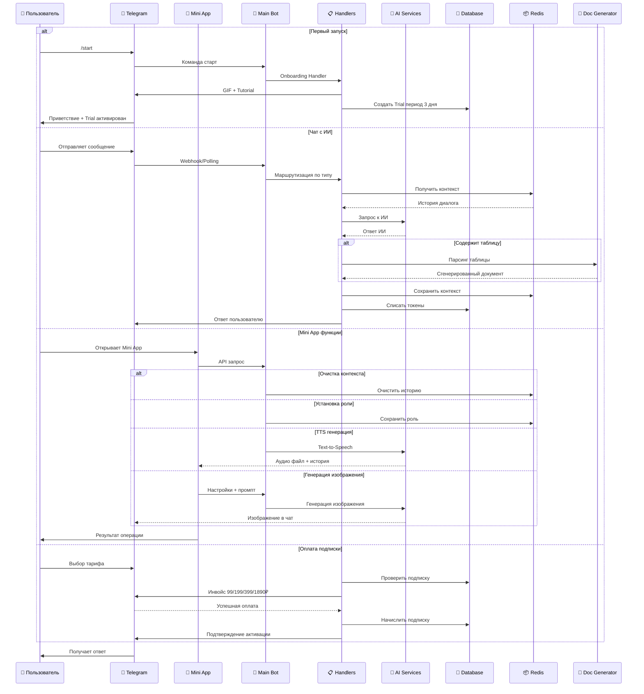

## Схема системы оплаты и тарифов

## Архитектура Mini App

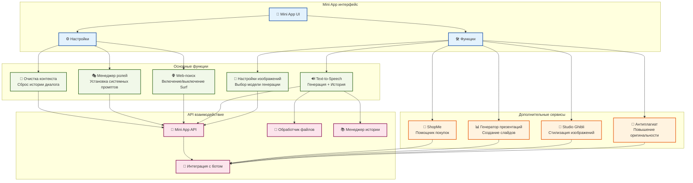

## Схема генерации документов

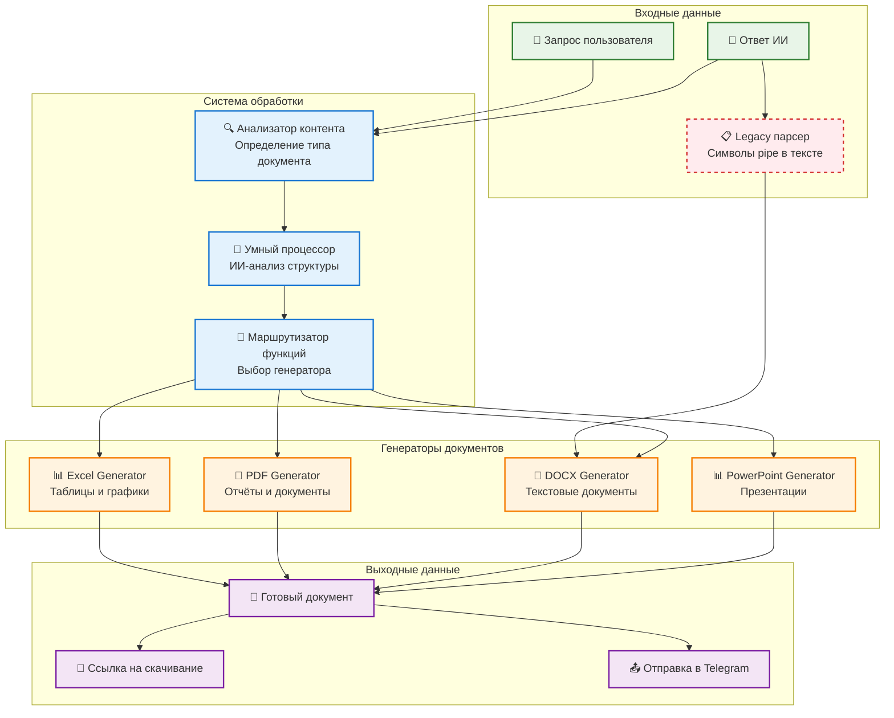

## Схема обработки типов сообщений

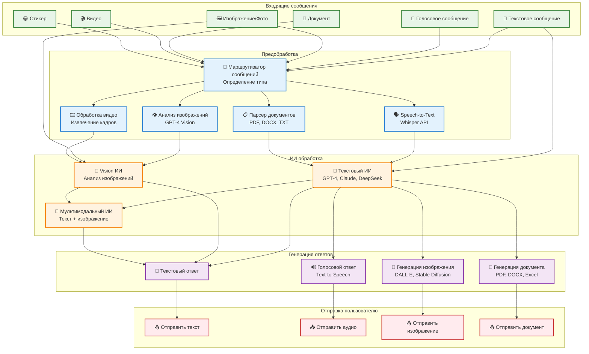

## Детальная схема обработки сообщений по типам

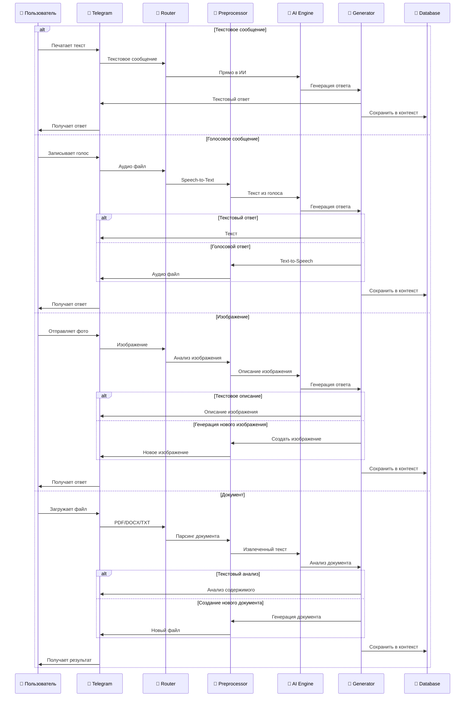

## Система режимов чата и мультимодального контекста

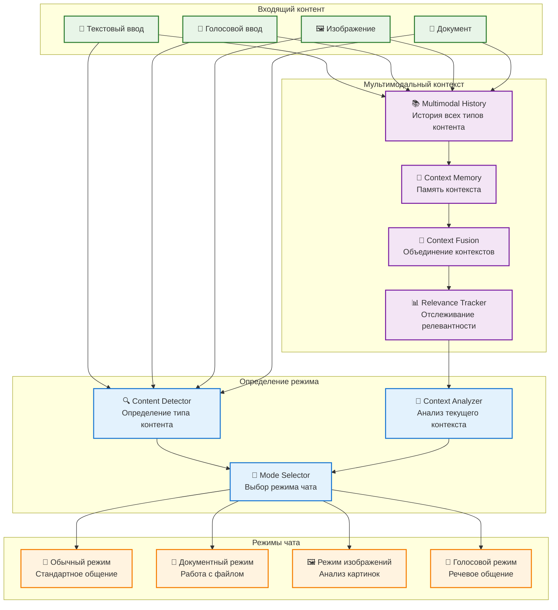

## Детальная схема работы с документами

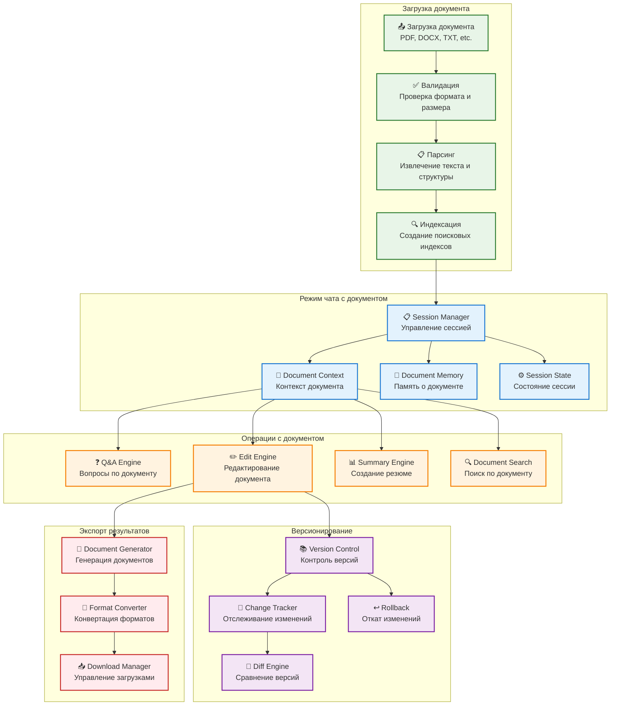

## Схема работы режимов чата

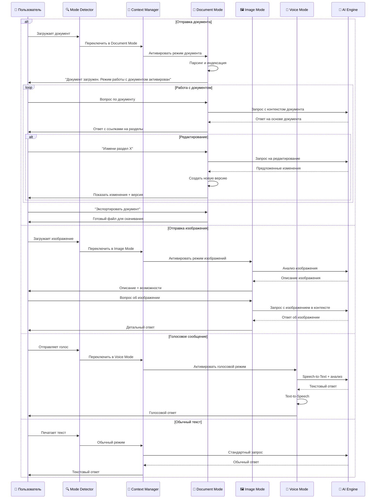

## Система управления контекстом и базами знаний

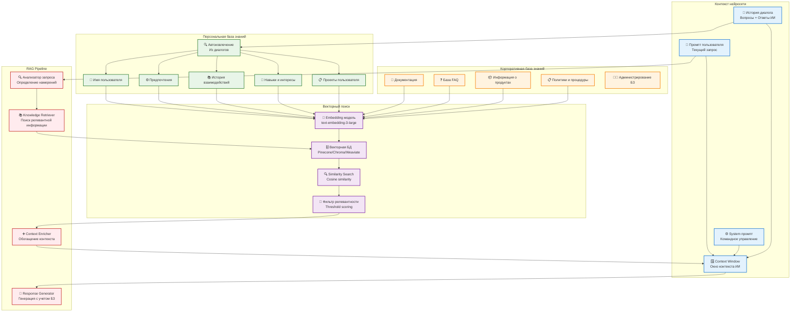

## Схема работы с контекстом и знаниями

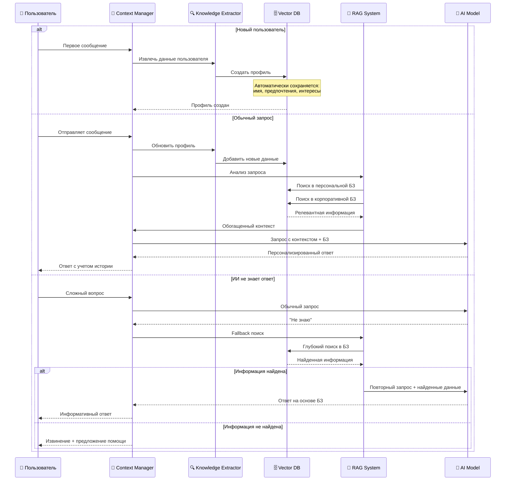

## Система режимов чата и мультимодального контекста

## Детальная схема работы с документами

## Схема работы режимов чата

