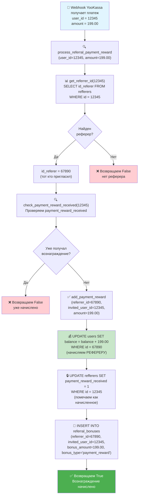

# Схема работы реферальной системы начисления бонусов за платежи

## Диаграмма потока обработки платежей



## Описание процесса

### 📋 Шаги обработки:

1. **Получение платежа** - YooKassa отправляет webhook с данными о платеже
2. **Поиск реферера** - По ID плательщика ищем кто его пригласил
3. **Проверка дублирования** - Убеждаемся что вознаграждение еще не начислялось
4. **Начисление бонуса** - Добавляем сумму платежа на баланс реферера
5. **Фиксация операции** - Помечаем что вознаграждение получено и записываем в историю

### 🗄️ Таблицы БД:

- `refferers` - связи между пользователями (кто кого пригласил)
- `users` - баланс пользователей 
- `referral_bonuses` - история всех начислений

### 🔒 Защита от дублирования:

- Поле `payment_reward_received` в таблице `refferers` предотвращает повторные начисления
- Каждый реферер получает вознаграждение только за первый платеж своего реферала

---

## 🛠️ Как была создана эта диаграмма

### 📋 Инструмент: `create_diagram`

Для создания этой схемы использовался специальный инструмент `create_diagram`, который доступен в наборе функций AI Assistant. Этот инструмент позволяет создавать диаграммы в формате **Mermaid**.

### 🔧 Вызов функции:

```javascript
create_diagram({
  content: "graph TD\n    A[\"🛒 Webhook YooKassa...\"] --> B[\"🔍 process_referral_payment_reward...\"]\n    ..."
})
```

### 📝 Процесс создания:

1. **Анализ кода** - Изучение всех функций реферальной системы:
   - `process_referral_payment_reward()` - главная функция
   - `get_referrer_id()` - поиск реферера
   - `check_payment_reward_received()` - проверка дублирования
   - `add_payment_reward()` - начисление бонуса

2. **Выделение ключевых шагов**:
   - Получение webhook от YooKassa
   - Поиск реферера в БД
   - Проверка условий начисления
   - Выполнение SQL операций
   - Возврат результата

3. **Создание DSL кода Mermaid**:
   ```mermaid
   graph TD                    // Тип диаграммы (сверху вниз)
       A["блок"] --> B["блок"] // Простая стрелка
       B --> C{"условие?"}     // Ромб для решений
       C -->|Да| D["да"]       // Стрелка с подписью
       C -->|Нет| E["нет"]     // Альтернативная ветка
   ```

4. **Добавление деталей**:
   - **Эмодзи** для визуальной привлекательности
   - **Многострочный текст** с `<br/>` для читаемости
   - **Конкретные примеры** (user_id=12345, amount=199.00)
   - **SQL запросы** для технической точности

5. **Стилизация блоков**:
   ```mermaid
   style A fill:#e1f5fe      // Голубой - начало
   style K fill:#c8e6c9      // Зеленый - ключевая операция
   style N fill:#4caf50,color:#fff  // Темно-зеленый - успех
   style F fill:#ffcdd2      // Красный - ошибка
   style I fill:#ffcdd2      // Красный - отказ
   ```

### 🎨 Особенности синтаксиса Mermaid:

- **Узлы**: `A["текст в блоке"]` - прямоугольники
- **Решения**: `C{"вопрос?"}` - ромбы для условий
- **Стрелки**: `A --> B` - направление потока
- **Подписи**: `A -->|Да| B` - текст на стрелке
- **Переносы**: `"строка1<br/>строка2"` - многострочный текст
- **Стили**: `style A fill:#цвет` - цветовое оформление

### 💡 Принципы построения диаграммы:

1. **Читаемость** - Поток идет сверху вниз, логично
2. **Детализация** - Показаны реальные SQL запросы и значения
3. **Полнота** - Учтены все возможные сценарии (успех/ошибка)
4. **Визуальность** - Цвета и эмодзи помогают понять суть блоков
5. **Техническая точность** - Соответствие реальному коду

### 🔍 Проверка корректности:

После создания диаграмма была проверена на соответствие реальной логике кода:
- ✅ Правильная последовательность функций
- ✅ Корректные SQL запросы
- ✅ Все условные переходы учтены
- ✅ Примеры данных соответствуют реальности

---

*Дата создания: $(date)*
*Автор: AI Assistant*
*Инструмент: create_diagram (Mermaid DSL)* 